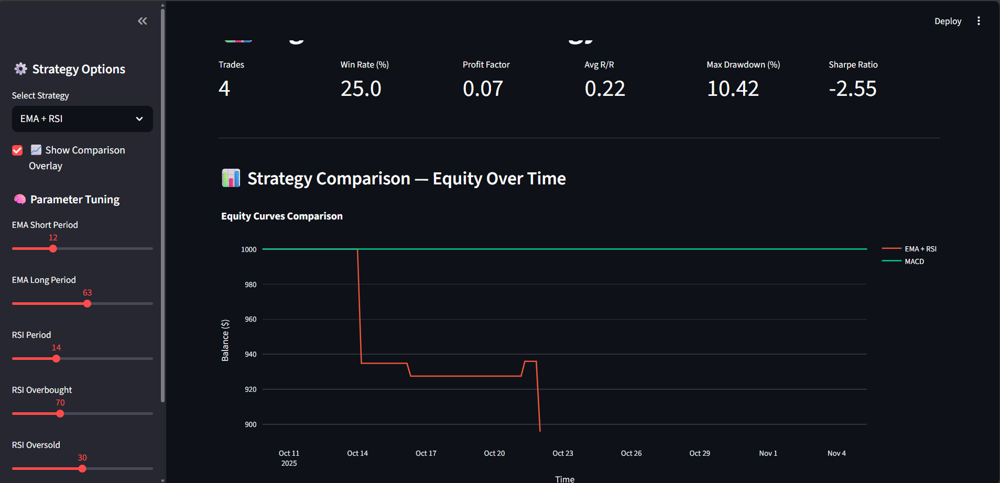

# 📊 Algo-Trader – Multi-Strategy Backtesting Dashboard  

A complete algorithmic trading research suite built in **Python + Streamlit**, featuring backtesting, analytics, and live strategy comparison.  

---

## 🧠 Features
- 📈 Multi-strategy backtesting (EMA+RSI & MACD)
- ⚙️ Dynamic risk management & drawdown control
- 🧩 Interactive parameter tuning (EMA, RSI, MACD)
- 💹 Real-time analytics dashboard (Streamlit + Plotly)
- 🧾 Strategy comparison table & equity overlay
- 💾 Export-ready data files for deeper research

---

## 🧱 Tech Stack
| Layer | Technology |
|-------|-------------|
| Backend | Python 3.11, Pandas, NumPy |
| Visualization | Streamlit, Plotly |
| Trading Logic | Custom EMA, RSI, MACD Strategies |
| Data | CoinGecko API (via ccxt/fallback) |
| Analytics | Custom metrics (Sharpe, Drawdown, Profit Factor) |

---

## 📸 Dashboard Preview

---

